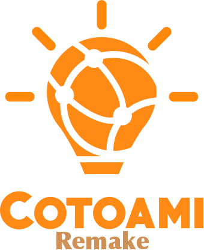
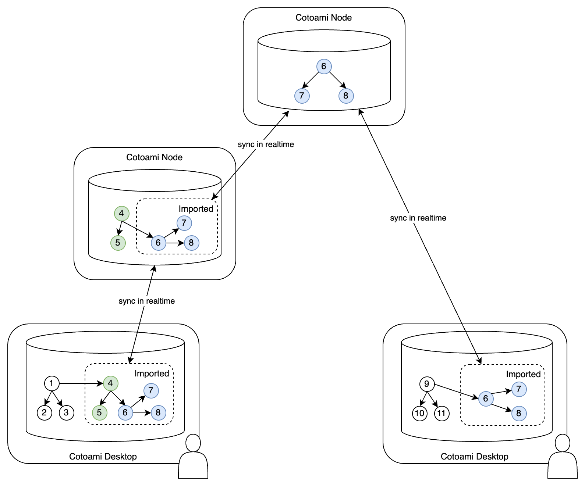

Cotoami is a standalone, cross-platform note-taking application designed to help you organize scattered information into meaningful knowledge—entirely on your own device, with full offline support.

Cotoami structures your input as “Cotos” (units of information) and connects them using “Itos” (links between Cotos). By building these connections, you transform isolated notes into an interconnected web of knowledge.

One unique feature is the built-in world map, allowing you to associate any information with geographic locations—even when offline, since the map is fully included within the app.

While Cotoami Remake is designed for private, offline use, it also offers a powerful collaboration option: you can connect to other users’ databases online and cooperatively edit knowledge as a team.

> Cotoami Remake is a complete reimagining of the original [Cotoami](https://github.com/cotoami/cotoami) web application, rebuilt from the ground up as a standalone desktop app for individual users who want a simple, private note-taking experience. While it retains the core concept of its predecessor, Cotoami Remake introduces entirely new features—such as integration with a built-in map and the ability to connect databases across users—making it a fundamentally different application.

## Concept

