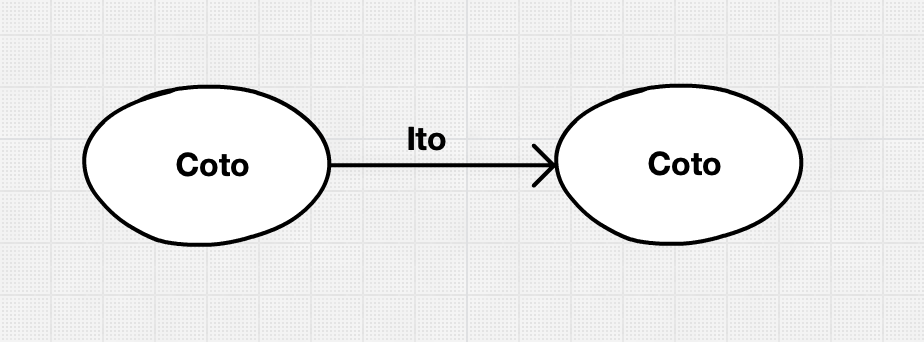
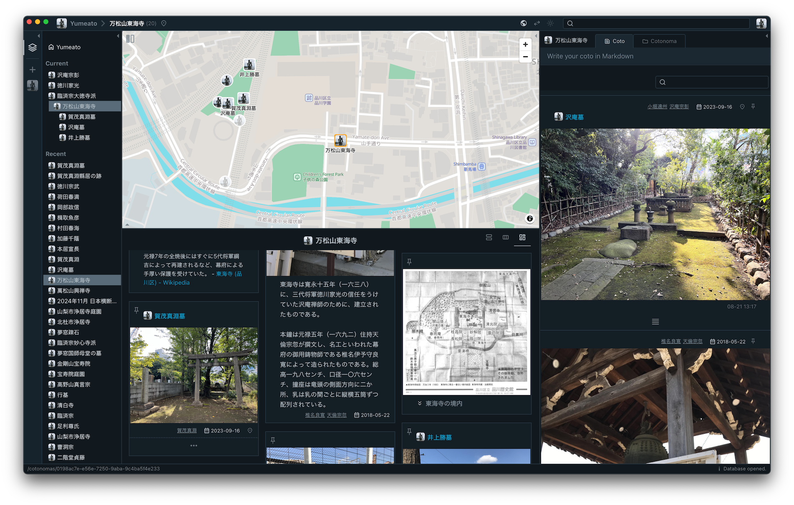
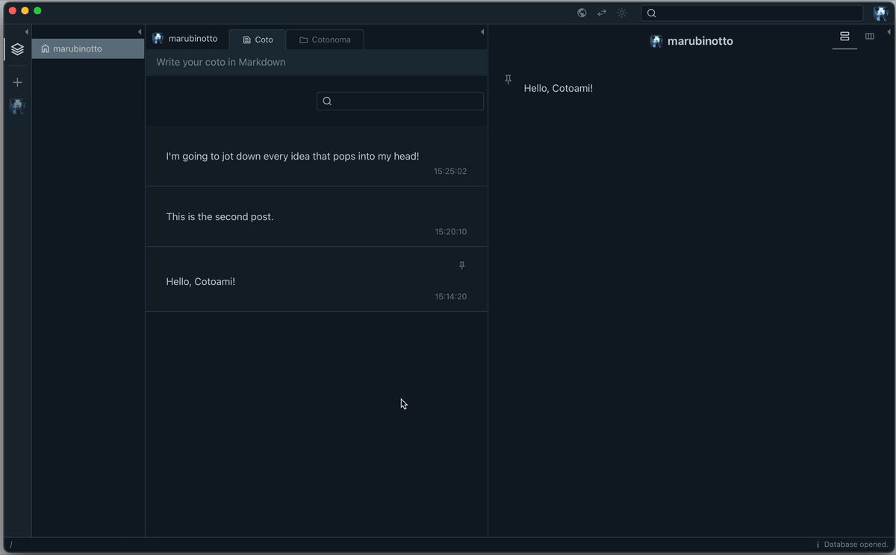
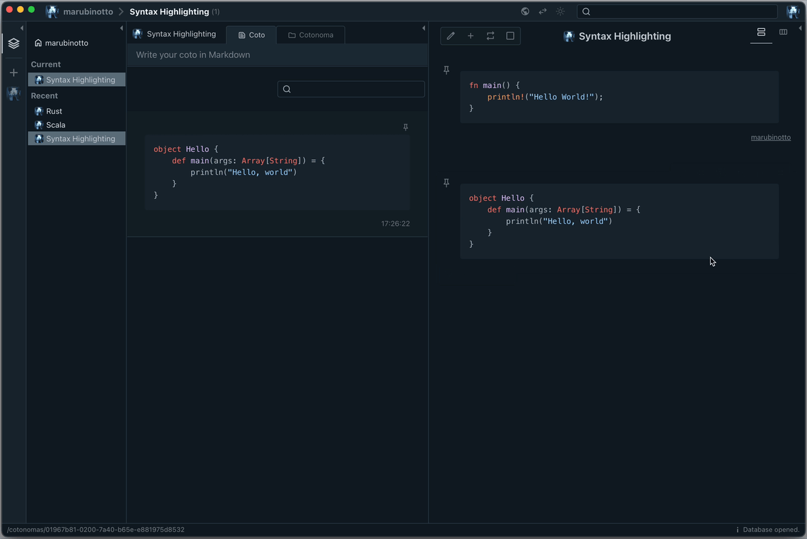
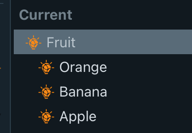
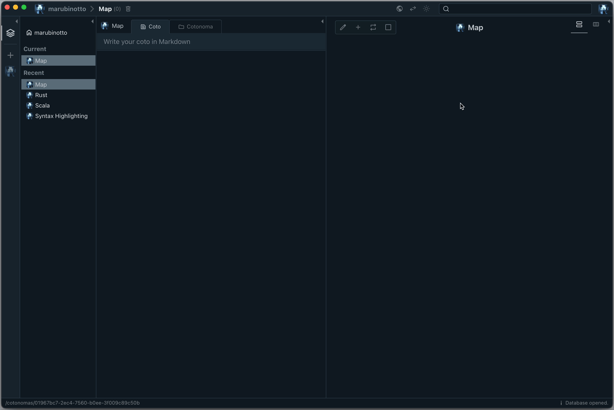
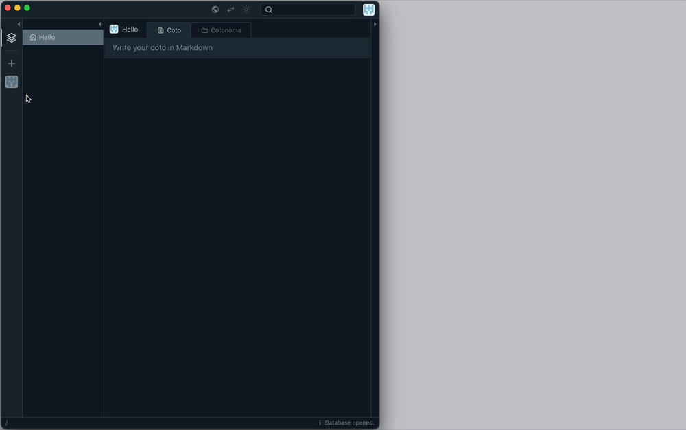

Cotoami (言編み・言網) is a standalone, cross-platform note-taking application designed to help you organize scattered information into meaningful knowledge—entirely on your own device, with full offline support.

* **What Cotoami Offers**
    * A personal database with a **chat-like interface** for entering data.
    * You can freely assemble the information you've entered **like LEGO blocks** to create larger documents.
    * Comes with a **built-in world map**, allowing you to register location-based information and build your own personalized map.
    * With the **[ChatGPT Plugin](cotoami_plugins/chatgpt)**, you can involve an AI chatbot in the process of building your knowledge.
    * Primarily a personal app that works offline, but you can also connect multiple databases to form a **[collaborative network](cotoami_node)** with other people.

Cotoami structures your input as “Cotos” (units of information) and connects them using “Itos” (links between Cotos). By building these connections, you transform isolated notes into an interconnected web of knowledge.

One unique feature is the built-in world map, allowing you to associate any information with geographic locations—even when offline, since the map is fully included within the app (powered by [OpenStreetMap](https://openstreetmap.org) and [Protomaps](https://github.com/protomaps/basemaps)).

While Cotoami is designed for private, offline use, it also offers a powerful collaboration option: you can connect to other users' databases online and cooperatively edit knowledge as a team.

> Cotoami Remake is a complete reimagining of the original [Cotoami](https://github.com/cotoami/cotoami) web application, rebuilt from the ground up as a standalone desktop app for individual users who want a simple, private note-taking experience. While it retains the core concept of its predecessor, Cotoami Remake introduces entirely new features—such as integration with a built-in map and the ability to connect databases across users—making it a fundamentally different application.

## Basic Usage

In Cotoami, you can casually post anything you want to remember—just like sending a chat message or writing a microblog. Each Coto you post is saved to your timeline.

> You can write your Cotos using Markdown. Cotoami supports [GitHub Flavored Markdown](https://github.github.com/gfm/), allowing for familiar formatting options like tables, task lists, and more. In addition, code blocks support syntax highlighting for a wide range of programming languages.

If you find certain Cotos especially important, you can “pin” them to the Stock area for quick access.

By linking related Cotos together with Itos, you can build a hierarchical structure of content, starting from any pinned Coto.

Cotos in the Stock area can be freely reordered within the same level, letting you arrange your key information just the way you like.

## Core Concept

In Cotoami, each individual post—or unit of information—is called a **Coto** (the Japanese word for “thing”). There is also a special type of Coto called a **Cotonoma** (Coto-no-ma means “a space of Cotos”). From an organizational perspective, a Cotonoma acts like a folder or category; from a communication perspective, it can be thought of as a chat room.

Each Cotonoma maintains its own timeline, where Cotos posted within it are collected. Since a Cotonoma is itself a kind of Coto, you can also link it to other Cotos or Cotonoma using **Itos** (the Japanese word for “thread”). Among these links, those starting from a Cotonoma are called **Pins**.

In summary, a Cotonoma is a container for two types of information:

* The “flow” of Cotos collected in its timeline
* The “stock” of Cotos pinned and organized hierarchically via Pins

This dual structure lets you both capture the stream of new information and organize key items for easy reference.

## The Knowledge Growth Cycle

One of the most important features of Cotoami is the ability to “promote” a Coto into a Cotonoma. This makes it possible to organically grow new Cotonomas as your knowledge develops, directly from existing information. Think of Cotonomas as entries in the catalog of your knowledge base.

The following diagram was created when I first came up with the idea for Cotoami's structure:

As illustrated above, the typical knowledge growth cycle in Cotoami works like this:

1. **Post Cotos to a Cotonoma**: Start by posting Cotos relevant to a certain Cotonoma.
2. **Connect Cotos with Itos**: As you add more Cotos, you may find relationships between them. Use Itos to build structures and connections.
3. **Promote a Coto to a Cotonoma**: When a particular Coto becomes central—often because it has many connections (Itos)—you can promote it to a Cotonoma. This allows you to dig deeper into that topic, giving it its own timeline and structure.
4. **Repeat the Process**: Inside the new Cotonoma, you can start the cycle again from step 1.

Not every Cotonoma needs to be created through this cycle—you can also create a new Cotonoma as a category right from the start if you already have something in mind. But if you only do that, your list of Cotonomas will be limited to what you already know or expect. By following the cycle above, you'll discover new and unexpected Cotonomas as your knowledge grows. This process of “discovery” is what the knowledge growth cycle is all about.

### Repost

By default, each Coto belongs to the Cotonoma in which it was originally posted. But what if you realize that a Coto is also relevant to another Cotonoma? One way is to connect it with an Ito from that Cotonoma, indicating a direct relationship. However, if the connection isn't strong enough to justify an Ito, you can use the **Repost** feature to post the Coto again on the timeline of a different Cotonoma. This allows a single Coto to belong to multiple Cotonomas through reposting. The Repost function becomes even more important when working with the networked database environment, which will be described later.

### Cotonoma Hierarchies

When you post one Cotonoma to the timeline of another, you can create a hierarchy between Cotonoma.

This allows you to build a traditional category hierarchy—but be careful not to lose what makes Cotoami special. As someone who uses a tool like Cotoami on a daily basis to organize thoughts and information, I've come to realize how deeply we hold certain assumptions about categories. One of the strongest is this: categories are somehow “above” the things that belong to them.

We usually think of “fruit” as a category, and “apple” or “banana” as elements inside it. That seems natural. And because of this bias, when we try to organize information, we often start by thinking about the categories first—just like deciding on folder names before actually saving any files.

In fact, the more interested someone is in organizing information, the more likely they are to try to set up a structure in advance.

But when we reflect on specific things we've encountered in everyday life, categories often feel more like attributes than containers. That’s when I started to suspect: maybe this whole idea of “higher” and “lower” isn’t about structure at all—it’s just a matter of where our focus is at any given moment.

When we focus on the category, we say: “An apple is a type of fruit.” But when our attention is on the apple itself, we might say: “It’s sweet, it’s red, and it’s a fruit.” In that case, “fruit” behaves like just another detail about the apple.

This kind of role reversal happens all the time, but we don’t usually notice it. That’s the surprising part. We unconsciously believe that categories come first, as if there’s a natural order to things. But our minds aren’t so fixed—they shift perspective constantly, depending on what we’re paying attention to.

From this perspective, the kind of emergent knowledge structure that Cotoami encourages probably won’t look like a neat hierarchy. Instead of a fixed tree with stable top-down relationships, it might look more like a web—where what appears “higher” in one moment becomes “lower” in another, depending on context.

Some people may believe that if you keep organizing information long enough, you'll end up with a tidy, universal classification—like a library system. But Cotoami aims for the opposite: a structure where personal context, not universal order, comes through.

In that sense, maybe “organization” isn’t even the right word. “Organization” implies making things easy to retrieve. But what Cotoami really aims for is discovery. And to get there, maybe we need to start by questioning our deep-rooted bias toward categories.

## Geolocated Cotos

Cotoami comes with a built-in world map. In fact, most of the application size (about 500MB) is taken up by this map data. The advantage is that Cotoami never needs to access online map services—you can use it completely offline, and you'll never have to worry about losing access if an external service is discontinued.

With this map, you can attach location information to any Coto or search for Cotos that already have geolocation. If you attach a photo with embedded GPS data (Exif info) to a Coto, the location will be registered automatically.

Of course, you can also assign a location to a Cotonoma. When a Cotonoma has location information, selecting it will automatically show that place on the map. Even if the Cotonoma itself doesn't have a location, Cotoami will automatically display the combined area covered by the locations of any geotagged Cotos it contains.

Actually, this geolocation feature was the main inspiration for rebuilding Cotoami from scratch. I realized that the purpose of “The Knowledge Growth Cycle”—the discovery of new knowledge—could also be applied to discovering new destinations and places in the world.

## Database Networking

Although Cotoami is designed as a standalone, privacy-first app that works perfectly offline, it also features a powerful database networking capability. While there aren't many real-world use cases to share yet, I believe this feature has a lot of potential—from connecting multiple personal databases for different purposes, to collaborating within a small team, or even supporting hierarchical cooperation across a larger organization.

Cotoami launches by opening a single database file, which is simply a local SQLite database. With Cotoami, you can connect databases over the network. These connections use WebSocket, allowing changes to be synchronized in real time (if WebSocket is not available in your environment, Cotoami automatically falls back to HTTP with Server-Sent Events (SSE) to maintain network connectivity). Each connected database is called a “Node.” The diagram below illustrates how these Nodes can be linked together.

When you connect two databases, one database incorporates the contents of the other as a part of its own. Since knowledge in Cotoami is managed as a graph, connecting to another database merges their graphs, making the information appear seamlessly connected to the user. Furthermore, as shown in the diagram, any connected database can itself be connected to other databases, so behind a single unified graph, there could actually be many underlying databases. As long as the network connection is active, remote databases remain synchronized in real time.

Here are some key points about the database networking feature:

* **Node as Account**: Each node acts like an account within the network, serving as your identity and the origin of any actions (such as posting or editing data) in other databases. In Cotoami, the node you operate from—acting as your account—is called the **Self Node**.
* **Seamless Graph Manipulation**: Connected databases can be used almost seamlessly. For example, you can link Cotos from different databases using an Ito, or repost a remote Coto to a local Cotonoma (however, you cannot repost a local Coto to a remote database, because it leads to accidental data exposure).
* **Offline Access**: All imported data is stored locally, so you can browse it even when offline—though you can't edit it until you reconnect. You can enable or disable each database connection at any time.
* **Granular Permissions**: On the database being imported (the remote node), you can finely control what operations are allowed by those importing it. By default, only posting is permitted, but you can also allow creating Itos or new Cotonomas.
* **Switch Node**: If your local node has “owner” privileges on a remote node, you can use the Switch Node feature to operate as if the remote node were local. This is especially useful for administering a [Cotoami Node Server](cotoami_node/README.md).
* **Attaching Private Notes on Remote Cotos**: You can create an Ito from a remote Coto to another Coto within the same remote node, or from a remote Coto to your own local Coto. The first type of Ito stays within the remote node, while the second type creates a cross-node connection. Since this cross-node connection is created on the local node, it is only visible to the local user, making it useful for adding private notes or annotations to remote content.
* **Permission Control by Hierarchy**: Posting to a remote node is only possible for directly connected nodes; you can browse deeper nodes (further down the connection chain), but you cannot post or edit content there. This makes it possible to build information networks such as: a main organizational node, with departmental nodes beneath it, and personal nodes beneath each department. In this structure, individuals can post to their department's Cotonoma but only view the organization-wide Cotonoma.

To learn how to build a network of Cotoami databases using the Node Server, see [cotoami_node](cotoami_node).

## Official Cotoami Node

The quickest way to understand what Cotoami is all about is to explore an actual database. For that purpose, we’ve set up an official Cotoami Node. It’s regularly updated with documentation about Cotoami, messages from the developer, and more. Launch Cotoami Desktop and add the following node:

* **Node URL**: https://node.cotoa.me
* **Password**: Leave it blank (you can link to it in read-only mode)

By default, only the timeline is visible. Make sure to open the *stock* area as shown below to access the full set of documents.

## Plugin System

In Cotoami v0.8.0, a plugin system based on WebAssembly was introduced. This system makes it possible to extend the functionality of Cotoami Nodes through plugins.

As the first official plugin, we have released the [ChatGPT Plugin](cotoami_plugins/chatgpt). It's more than just sending a message to ChatGPT and receiving a reply — it leverages Cotoami's unique structure to deliver powerful capabilities.

What you can do with the Cotoami × ChatGPT integration:

* ChatGPT's responses are saved directly into your own database.
* Since each response is just another Coto (Cotoami's unit of information), you can pin it, connect it to other Cotos, and use it freely as a part of your knowledge graph.
* The ChatGPT plugin doesn't treat the message in isolation—it understands the surrounding knowledge graph as context. This means you can fully control and edit the context using Cotoami's features.
* If you're sharing a remote node with others, you can bring ChatGPT into your team conversations as a participant.
* The ChatGPT plugin is aware of the author of each Coto passed as context, so it can respond to questions that refer to specific participants by name.

[Available Cotoami Plugins](cotoami_plugins)

## Why Use This Application?

As of its initial release in 2025, there are already countless note-taking apps available—both online services and standalone applications, with some clear industry standards among them. So, why go out of your way to use this one? Honestly, I created this program simply because it was something I personally wanted to use. I can't say for certain whether it will be the best choice for everyone. However, in developing Cotoami Remake, I've paid special attention to the following points, beyond just the features themselves:

* **Privacy**: All data you create stays entirely on your own device.
* **Data Portability**: Your data is always yours. Cotoami saves everything in a standard SQLite database file, so you can access, read, or edit your notes using any tool that works with SQLite—even without Cotoami itself. Future versions of Cotoami will continue to support your existing data.
* **Offline Availability**: Cotoami does not rely on any online services—you can use it completely offline.
* **All-in-One**: No additional runtimes or dependencies are required. You can use Cotoami right after downloading it, and it's designed to remain usable for as long as possible.
    * Strictly speaking, the current version of Cotoami does depend on the WebView component included in each operating system, which could potentially cause compatibility issues in the future. 

## Download and Install

Download the latest version of Cotoami for your platform (Windows, Linux, or macOS) from the [releases page](https://github.com/cotoami/cotoami-remake/releases).

* File names of downloadable packages by platform:
    * macOS
        * `Cotoami_<version>_universal.dmg`
            * For both Apple silicon and Intel-based Mac computers.
            * Since v0.7.0, this package is properly signed and notarized by Apple.
    * Linux
        * `cotoami_<version>_amd64.AppImage`
        * For debian-based distributions: `cotoami_<version>_amd64.deb`
    * Windows
        * `Cotoami_<version>_x64_en-US.msi`
        * Please note that the application is not digitally signed for now, so you may need to bypass your operating system's security warnings to install and run it for the first time.

Cotoami's source code is released under Apache 2 License. Check the [LICENSE](LICENSE) file for more information.

## Updates and Feedback

Updates about Cotoami are shared on the following platforms. In particular, the Patreon page will feature various posts about development progress, insights gained through this project, and more. You're very welcome to follow—even without making a donation 😉

* https://x.com/cotoami
* https://www.patreon.com/cotoami

Feedback and bug reports are welcome on [GitHub Discussions](https://github.com/cotoami/cotoami-remake/discussions).

## Special Thanks

This program could not have been created without the help of the amazing people and projects listed below. I would like to express my sincere gratitude to them here. While this list is not exhaustive, Cotoami also relies on many other open source projects beyond those mentioned here.

* [Tauri](https://tauri.app/)
* [Rust Programming Language](https://www.rust-lang.org/)
* [Scala.js](https://www.scala-js.org/)
* [React](https://react.dev/)
* [The Elm Architecture](https://guide.elm-lang.org/architecture/)
* [OpenStreetMap](https://openstreetmap.org)
* [Protomaps](https://github.com/protomaps/basemaps)
* [MapLibre](https://maplibre.org/)
* The beautiful logo is designed by [@reallinfo](https://github.com/reallinfo)
