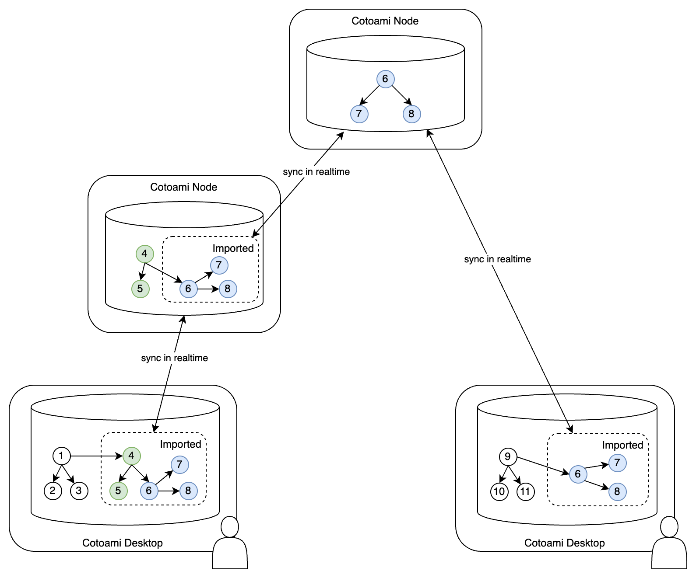
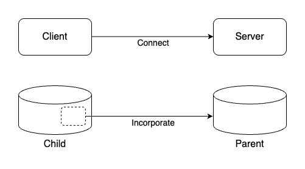
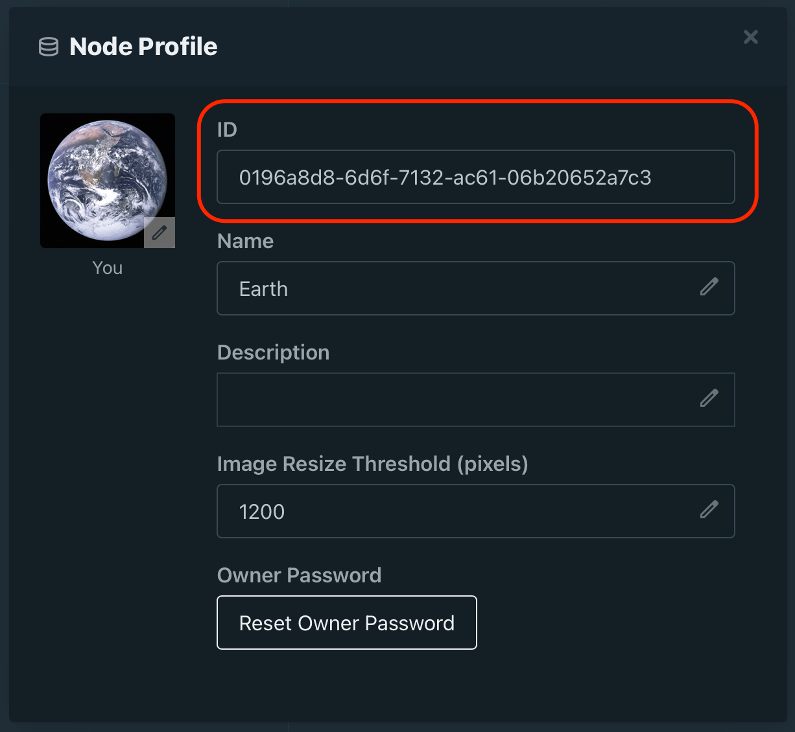

# Cotoami Node Server

Cotoami Node Server provides a Cotoami database that is intended to be accessed remotely. Applications like Cotoami Desktop or other Cotoami Nodes connect to this Node Server via HTTP or HTTPS and incorporate its contents as part of their own databases. Once connected, any changes to the database are propagated to other nodes in real time through WebSocket or Server-Sent Events. With Cotoami Node Server, collaborative work becomes possible by sharing a common database.

<p align="center"></p>

### Node Roles

A unique aspect of the Cotoami Node network is the separation between the roles defined at the network level (**client/server**) and those defined at the database level (**child/parent**). In terms of connection, the initiator of a connection is referred to as the *client*, and the recipient is the *server*. Meanwhile, in terms of database relationships, the node that pulls in data is called the *child*, and the one whose data is being pulled is the *parent*. These roles are independent, which allows configurations where the Server acts as a child, rather than always as a parent.

<p align="center"></p>

> Note: While this separation of roles is already implemented internally, the current version only supports configurations where the server takes on the parent role. Future versions will support role reversal to enable more flexible configurations.


## Launch Server

Cotoami Node Server is provided as a Docker image: [cotoami/cotoami-node](https://hub.docker.com/r/cotoami/cotoami-node).

You can configure the container using the following environment variables:

* `COTOAMI_DB_DIR`
    * Path to the Cotoami database directory.
* `COTOAMI_NODE_NAME`
    * The name used when creating a new node. If no existing database is found at the path specified by `COTOAMI_DB_DIR`, a new database will be created on startup, and this value will be used as the node name.
    * If a database already exists at the specified path, this value will be ignored.
* `COTOAMI_OWNER_PASSWORD`
    * The owner password of the target node will be set to this value if the node does not yet have one.
    * If the node already has an owner password, the server will only start if this value matches the existing password.
* The following settings allow you to grant owner privileges to a specific remote node, enabling remote management of this node:
    * `COTOAMI_OWNER_REMOTE_NODE_ID`
        * Registers the specified node as a *client/child* and grants it owner privileges.
        * If you want to manage the Node Server from Cotoami Desktop using the "Switch Node" feature, set this to the node ID of the database used by your desktop app.
    * `COTOAMI_OWNER_REMOTE_NODE_PASSWORD`
        * Specifies the password that the remote node (defined in COTOAMI_OWNER_REMOTE_NODE_ID) must use to connect to this node.
        * This is ignored if the node has already been registered (i.e., it is not used to update an existing password).
* `COTOAMI_SESSION_MINUTES`
    * The session duration (in minutes) for connected client nodes (default: `1440` minutes = `24` hours).
    * Clients will automatically reconnect after session expiration.
* `COTOAMI_CHANGES_CHUNK_SIZE`
    * The number of changes sent at once when pushing database update logs to each child node (default: `100`).
* `COTOAMI_SERVER_PORT`
    * Port number on which the server will run (default: `5103`).
* The following variables configure the external URL of this server as seen from other nodes. These settings are used for displaying URLs in the UI and for CSRF protection:
    * `COTOAMI_SERVER_URL_SCHEME`
        * URL scheme (`http` or `https`) used by client nodes to connect to this server (default: `http`).
    * `COTOAMI_SERVER_URL_HOST`
        * Host name used by client nodes to connect (default: `localhost`).
    * `COTOAMI_SERVER_URL_PORT`
        * Port number to be included in the server URL.
* `COTOAMI_SERVER_ENABLE_WEBSOCKET`
    * Whether to allow WebSocket connections to this node (`true` or `false`; default: `true`).
    * If set to false, communication with client nodes will use HTTP(S)/Server-Sent Events instead.

Below is an example Docker Compose configuration (`compose.yaml`):

```yaml
services:
  # Sun: http://localhost:5103
  cotoami-node-sun:
    image: cotoami/cotoami-node:latest
    ports:
      - 5103:5103
    volumes:
      - sun-storage:/data
    environment:
      RUST_LOG: info
      COTOAMI_DB_DIR: /data
      COTOAMI_NODE_NAME: Sun
      COTOAMI_OWNER_PASSWORD: sun-password
      COTOAMI_OWNER_REMOTE_NODE_ID: 0196a8d8-6d6f-7132-ac61-06b20652a7c3
      COTOAMI_OWNER_REMOTE_NODE_PASSWORD: earth-password
      COTOAMI_SERVER_PORT: 5103
      COTOAMI_SERVER_URL_SCHEME: http
      COTOAMI_SERVER_URL_HOST: localhost
      COTOAMI_SERVER_URL_PORT: 5103
      COTOAMI_SERVER_ENABLE_WEBSOCKET: "true"

volumes:
  sun-storage:
```

## Administer Server

You can manage a Cotoami Node Server remotely using Cotoami Desktop.
To do this, you’ll need a separate Cotoami database (node) aside from the Node Server itself.
By registering this database as the **owner** of the target node, you’ll be able to use the **Switch Node** feature in Cotoami Desktop. This allows you to operate the remote database as if it were your local one.

To get started, open the database you want to assign owner privileges to in Cotoami Desktop and check its Node ID in the **Node Profile** modal which can be opened by clicking on the icon at the top-right corner of the main screen:

<p></p>


## Connect Nodes

