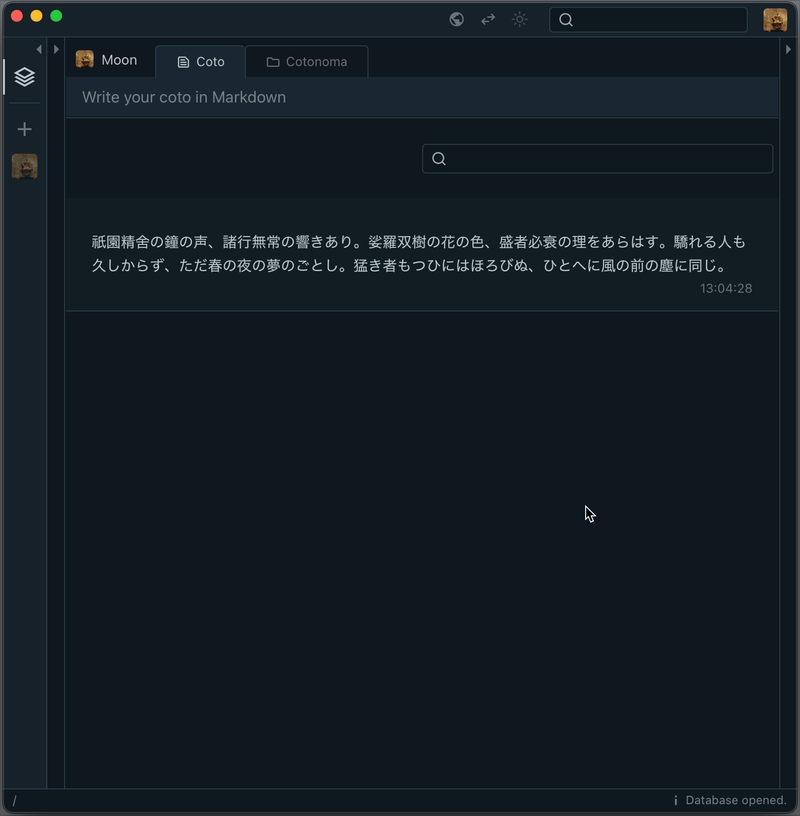

# Cotoami ChatGPT Plugin

The ChatGPT plugin brings a ChatGPT agent into the conversation within Cotoami. If you start a Coto with `#chatgpt`, the ChatGPT API will generate a response to the content that follows.


* What you can do with the Cotoami × ChatGPT integration:
    * ChatGPT's responses are saved directly into your own database.
    * Since each response is just another Coto (Cotoami's unit of information), you can pin it, connect it to other Cotos, and use it freely as a part of your knowledge graph.
    * The ChatGPT plugin doesn't treat the message in isolation—it understands the surrounding knowledge graph as context. This means you can fully control and edit the context using Cotoami's features.
    * If you're sharing a remote node with others, you can bring ChatGPT into your team conversations as a participant.
    * The ChatGPT plugin is aware of the author of each Coto passed as context, so it can respond to questions that refer to specific participants by name.

### Knowledge Graph as Context

One Cotoami-specific feature is the ability to post a `#chatgpt` Coto connected to another Coto using the ＋ button. When you do this, the ChatGPT plugin will walk backward through the directed graph to collect all relevant Cotos as context. This allows you to freely craft and edit the context you provide to ChatGPT.



### Recognizing Who Said What

The ChatGPT plugin recognizes the author of each Coto provided as context. This allows it to answer questions that refer to specific speakers, like the examples below.

<p></p>


## Download

* [cotoami_plugin_chatgpt.wasm](https://github.com/cotoami/cotoami-remake/releases/latest/download/cotoami_plugin_chatgpt.wasm)


## Install

* Cotoami v0.8.0 or later required.
* Copy the plugin file into the `<database-folder>/plugins` folder.
* Add the following configuration to `<database-folder>/plugins/configs.toml`.
    * If `configs.toml` does not exist, create a new file.
* Restart the application.

### Configuration

```toml
["app.cotoami.plugin.chatgpt"]
allowed_hosts = "api.openai.com"
api_key = "your api key"
model = "gpt-4o"

# developer-provided instruction (optional)
developer_message = "You are a helpful assistant."  
```

* `api_key` - You need to sign up for the [OpenAI API](https://platform.openai.com/) and obtain an API key.
* `model` - Refer to <https://platform.openai.com/docs/models>
* `developer_message` (optional) - Developer-provided instructions that the model should follow, regardless of messages sent by users.


## Build

Debug build:

```shell
cargo build
```

Release build:

```shell
cargo build --release
```
