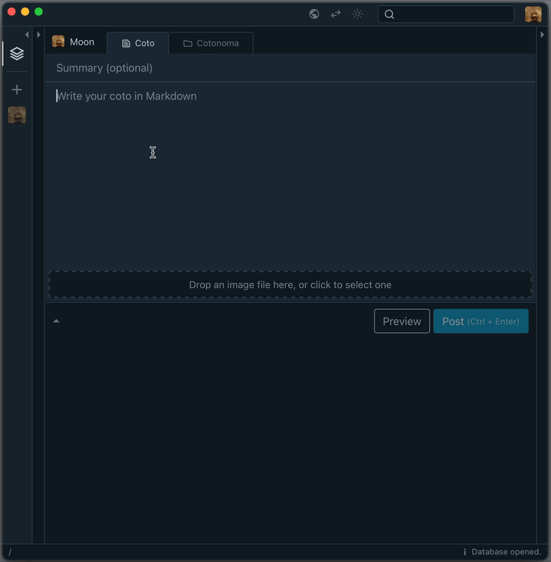

# Cotoami Echo Plugin

The Echo plugin is a simple plugin that mimics and reposts the content of any Coto that starts with `#echo`.




## Download

* [cotoami_plugin_echo.wasm](https://github.com/cotoami/cotoami-remake/releases/latest/download/cotoami_plugin_echo.wasm)


## Install

Copy the plugin file into the `<database-folder>/plugins` folder.


## Build

Debug build:

```shell
cargo build
```

Release build:

```shell
cargo build --release
```

